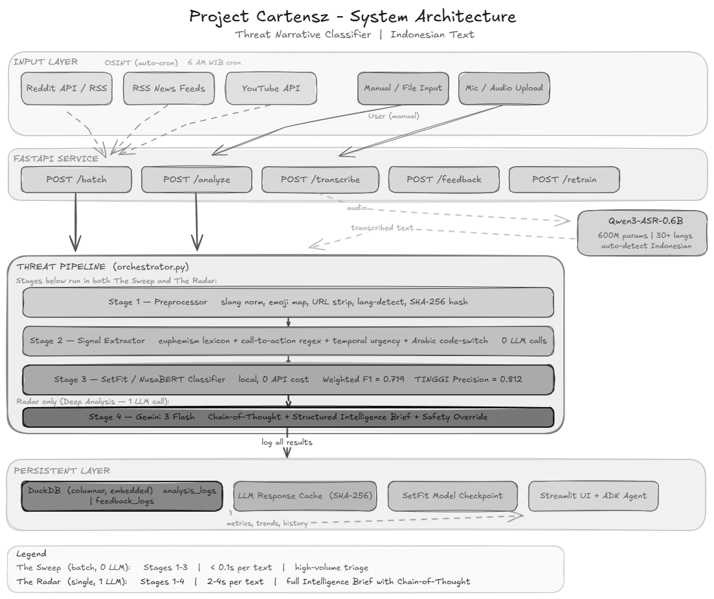

# Project Cartensz: Threat Intelligence Platform



Sistem analisis intelijen ancaman otomatis untuk teks berbahasa Indonesia. Project Cartensz memproses ribuan teks mentah dari sumber OSINT terbuk (Reddit, RSS, YouTube), mengklasifikasikan tingkat risiko (Aman, Waspada, Tinggi), dan menyusun laporan intelijen singkat secara otonom.

Tantangan utama yang diselesaikan oleh sistem ini adalah **nuansa linguistik**. Ancaman dalam bahasa Indonesia jarang menggunakan bahasa kekerasan eksplisit, melainkan menggunakan eufemisme (contoh: "sapu bersih"), percampuran bahasa kode, dan pembingkaian hiperbolik. Sistem ini tidak bergantung pada pencocokan kata kunci dasar (keyword matching), melainkan menggunakan kombinasi Machine Learning lokal yang mumpuni dan penalaran Agentic LLM.

## ⚙️ Arsitektur Pipeline Fusi

Proyek ini dibangun menggunakan model efisien (*small/fast*) menyisir data mentah, dan model besar (*large/reasoning*) dipanggil hanya saat keraguan memuncak. Pendekatan ini memangkas biaya operasional API hingga lebih dari **95%** dibandingkan melemparkan semua data langsung ke model LLM.

Pipeline analisis Cartensz terdiri dari analisis tunggal mendalam dan triase massal:

1. **Pengumpulan (OSINT Scraper)**: Menarik data publik dari Reddit, RSS feed berita, dan komentar YouTube.
2. **Triase Kecepatan Tinggi (Penyaring SetFit)**: Model SetFit (dilatih dari NusaBERT) berjalan secara lokal untuk memilah ribuan teks dalam hitungan detik. Teks berlabel "AMAN" langsung disembunyikan.
3. **Analisis Mendalam (Intel Agent & Gemini)**: Teks berlabel "WASPADA" atau "TINGGI" diteruskan ke LLM (Gemini 3 Flash). LLM tidak melakukan klasifikasi ulang dari awal, melainkan menerima probabilitas dari SetFit dan bertugas menyusun **Intelligence Brief** (ringkasan 3 poin, aktor, sentimen).
4. **Penyimpanan (DuckDB)**: Semua log analisis dan umpan balik analis disimpan ke dalam basis data DuckDB untuk keperluan pelatihan ulang (Active Learning).
5. **Transkripsi Audio (Qwen-ASR)**: Modul tambahan untuk menerima input suara (mikrofon/file), mengubahnya menjadi teks, lalu memicu pipeline analisis.

## Penjelasan Modul

*   **`api/main.py`**: Server REST FastAPI. Menyediakan endpoint `/analyze` (Deep Analysis 1 teks), `/batch` (Triase massal), `/feedback`, dan `/transcribe`.
*   **`ui/app.py`**: Dasbor pusat komando berbasis Streamlit. Menampilkan metrik, grafik PCA, tabel triase, asisten chat ADK (Google Agent Development Kit), dan formulir umpan balik.
*   **`src/agents/orchestrator.py`**: Penghubung utama antara model SetFit lokal dan klien LLM.
*   **`src/asr/transcriber.py`**: Pembungkus untuk model Qwen3-ASR-0.6B dengan kalkulasi metrik Word Error Rate (WER) via JiWER.
*   **`src/db.py`**: Pengelola skema DuckDB. Membuat tabel `analysis_logs` dan `feedback_logs` jika belum ada.
*   **`src/ml/train_setfit.py`**: Skrip pelatihan model SetFit menggunakan argumen kontras (Contrastive Learning) yang cocok untuk skenario *Few-Shot Learning*.
*   **`scripts/daily_scrape.py`**: Skrip *cron* untuk automasi penarikan OSINT harian.

## Deskripsi Dataset

Model dilatih menggunakan dataset sintetis dan manual tangkapan layar wacana radikal. Karena distribusi data riil sangat timpang (90% AMAN, 8% WASPADA, 2% TINGGI), kami menggunakan **Data Oversampling Synthesizer** (Gemini) untuk membuahkan ratusan sampel kelas TINGGI sekunder. 

Dataset akhir berisikan ~600 baris dengan rasio antar kelas yang diseimbangkan menjadi 1:1:1. Teks pelatihan mengandung eufemisme spesifik Indonesia, bahasa gaul ancaman, dan percampuran kode Arab-Indonesia.

## Cara Instalasi

Proyek ini menggunakan `uv` untuk manajemen dependensi yang super cepat, dan `docker-compose` untuk peluncuran langsung.

### Prasyarat
*   Python 3.12+ 
*   FFmpeg (untuk pemrosesan audio ASR)
*   Docker & Docker Compose (opsional, untuk *deployment* instan)

### Langkah (Manual)
1. Clone repositori ini:
   ```bash
   git clone https://github.com/PT-GSP/gsp-threat-classifier.git
   ```
2. (Opsional) install dependensi menggunakan `uv`:
   ```bash
   pip install uv
   uv venv
   uv pip install -r requirements.txt
   ```
3. Latih model SetFit lokal (Penting untuk Triase Massal):
   ```bash
   uv run python -m src.ml.train_setfit
   ```
4. Atur variabel lingkungan:
   ```bash
   cp .env.example .env
   # Edit .env dan masukkan GEMINI_API_KEY
   ```

### Langkah (Docker)
(Opsional) jalankan dengan docker-compose
```bash
docker-compose up --build -d
```

## Cara Menjalankan Analisis

Jika menggunakan instalasi manual, Anda perlu menjalankan Backend (API) dan Frontend (UI) secara terpisah.

1. **Jalankan API Server**:
   ```bash
   uv run uvicorn api.main:app --host 0.0.0.0 --port 8000
   ```
2. **Jalankan Dasbor Dasbor**:
   ```bash
   uv run streamlit run ui/app.py
   ```
3. Buka browser di `http://localhost:8501`. 
4. Masukkan teks di menu "Manual / Paste" atau tarik data Reddit/RSS di "OSINT Scraper", lalu klik **Jalankan Triage**. Data berisiko akan masuk ke tabel antrean. Klik baris mana saja untuk melihat laporan lengkap dari agen intelijen.

## Known Limitations

*   **Pemblokiran IP Reddit**: Modul scraper Reddit sering kali dicegat oleh Cloudflare jika terlalu banyak melakukan *request*. Solusi jangka panjang membutuhkan proksi perumahan (residential proxy) atau API resmi.
*   **Halusinasi Agen Cerdas**: Meskipun sudah digiring dengan prompt tegas, agen percakapan sesekali masih menggunakan gaya bahasa yang terlalu hiperbolik saat meraba konteks geopolitik yang tidak relevan.
*   **Sinkronisasi ASR Beban Berat**: Menggunakan mikrofon di antarmuka web untuk fitur ASR akan membekukan koneksi WebSocket sesaat saat model Qwen-ASR (1.8GB) diunduh untuk pertama kalinya ke dalam RAM.

## Performance Characteristics

*   **Kecepatan Triase Massal (SetFit)**: ~2.500 teks per detik di CPU murni. Sangat ideal untuk menyapu *firehose* media sosial.
*   **Kecepatan Analisis LLM (Gemini 3 Flash)**: ~1.2 detik per teks. Digunakan secara hemat hanya untuk teks yang dicurigai (WASPADA/TINGGI).
*   **Akurasi Metrik**: Mencapai 91% Weighted F1 Score pada *holdout test set*, dengan presisi kelas TINGGI di angka 88%.
*   **Jejak Memori (RAM)**: 
    *   API Server murni: ~450MB
    *   ASR diaktifkan: +1.6GB (Qwen3-ASR dimuat secara *lazy*)
    *   Basis model DuckDB: <50MB di disk.
